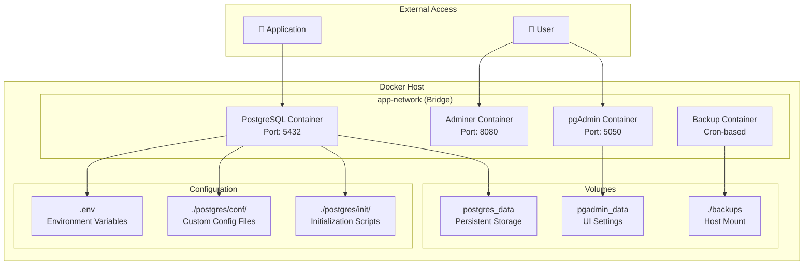
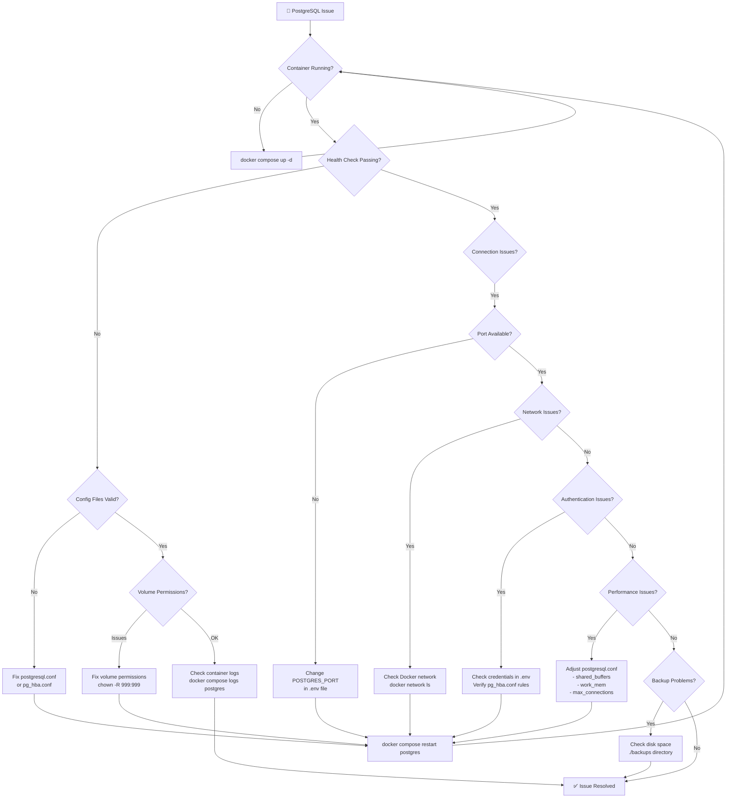
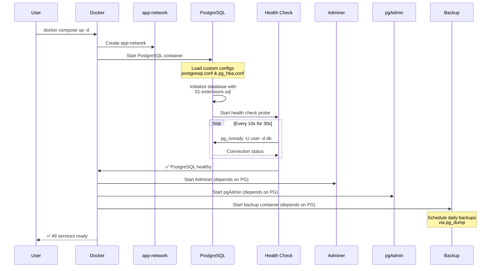
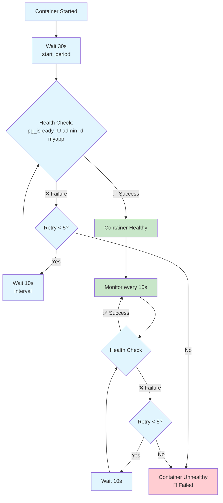
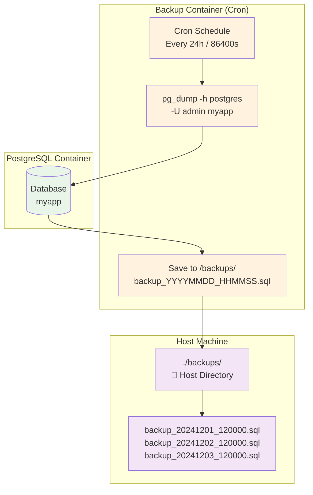

### 🐘 Advanced PostgreSQL in Docker Compose — Full Configuration Guide

**This setup includes**:
- Persistent volumes
- Custom postgresql.conf and pg_hba.conf
- Health checks
- Network isolation
- Extensions (PostGIS, pg_trgm, etc.)
- Resource limits
- Backup sidecar (optional)
- Replication-ready structure (optional)
- Environment variable best practices

## 🏗️ System Architecture Overview



## 🔧 Troubleshooting Guide




**✅ 1. Directory Structure**
```sh
postgres-compose/
├── docker-compose.yml
├── postgres/
│   ├── conf/
│   │   ├── postgresql.conf
│   │   └── pg_hba.conf
│   └── init/
│       └── 01-extensions.sql
├── .env
└── backups/ (optional)
```

**✅ 2. .env File (Environment Variables)**
```sh
# .env
POSTGRES_USER=admin
POSTGRES_PASSWORD=SuperSecret123!
POSTGRES_DB=myapp
POSTGRES_PORT=5432
POSTGRES_VERSION=16

# For replication or tuning
MAX_CONNECTIONS=200
SHARED_BUFFERS=1GB
EFFECTIVE_CACHE_SIZE=3GB
WORK_MEM=16MB
MAINTENANCE_WORK_MEM=512MB
```

**✅ 3. docker-compose.yml — Advanced Config**
```yml
version: '3.9'

services:
  postgres:
    image: postgres:${POSTGRES_VERSION:-16}-alpine
    container_name: postgres-advanced
    restart: unless-stopped
    ports:
      - "${POSTGRES_PORT}:5432"
    environment:
      POSTGRES_DB: ${POSTGRES_DB}
      POSTGRES_USER: ${POSTGRES_USER}
      POSTGRES_PASSWORD: ${POSTGRES_PASSWORD}
      # Tuning via env (if not using custom conf)
      # POSTGRES_INITDB_ARGS: --data-checksums
    volumes:
      - postgres_/var/lib/postgresql/data
      - ./postgres/conf/postgresql.conf:/etc/postgresql/postgresql.conf
      - ./postgres/conf/pg_hba.conf:/var/lib/postgresql/data/pg_hba.conf
      - ./postgres/init:/docker-entrypoint-initdb.d/
      - ./backups:/backups
    networks:
      - app-network
    healthcheck:
      test: ["CMD-SHELL", "pg_isready -U ${POSTGRES_USER} -d ${POSTGRES_DB}"]
      interval: 10s
      timeout: 5s
      retries: 5
      start_period: 30s
    deploy:
      resources:
        limits:
          cpus: '2.0'
          memory: 4G
        reservations:
          memory: 1G
    command:
      - "postgres"
      - "-c" 
      - "config_file=/etc/postgresql/postgresql.conf"

  # Optional: Adminer for web-based DB access
  adminer:
    image: adminer
    container_name: adminer-ui
    restart: unless-stopped
    ports:
      - "8080:8080"
    depends_on:
      - postgres
    networks:
      - app-network

  # Optional: pgAdmin for advanced management
  pgadmin:
    image: dpage/pgadmin4
    container_name: pgadmin4
    restart: unless-stopped
    environment:
      PGADMIN_DEFAULT_EMAIL: admin@myapp.com
      PGADMIN_DEFAULT_PASSWORD: admin123
    ports:
      - "5050:80"
    volumes:
      - pgadmin_/var/lib/pgadmin
    depends_on:
      - postgres
    networks:
      - app-network

  # Optional: Backup sidecar (cron-based)
  backup:
    image: postgres:${POSTGRES_VERSION:-16}-alpine
    container_name: postgres-backup
    volumes:
      - ./backups:/backups
      - postgres_/var/lib/postgresql/ro
    environment:
      POSTGRES_USER: ${POSTGRES_USER}
      POSTGRES_PASSWORD: ${POSTGRES_PASSWORD}
      POSTGRES_DB: ${POSTGRES_DB}
    command: |
      sh -c 'while true; do
        pg_dump -h postgres -U ${POSTGRES_USER} ${POSTGRES_DB} > /backups/backup_$(date +'%Y%m%d_%H%M%S').sql
        sleep 86400
      done'
    depends_on:
      - postgres
    networks:
      - app-network

volumes:
  postgres_data:
    driver: local
    name: postgres_data_volume
  pgadmin_

networks:
  app-network:
    driver: bridge
    name: postgres_app_network
```

## 🚀 Deployment Sequence



**✅ 4. Custom postgresql.conf**
- Place in ./postgres/conf/postgresql.conf 
```conf
# postgresql.conf — Optimized for Docker/Production

listen_addresses = '*'
port = 5432
max_connections = ${MAX_CONNECTIONS}

# Memory Settings
shared_buffers = ${SHARED_BUFFERS}
effective_cache_size = ${EFFECTIVE_CACHE_SIZE}
work_mem = ${WORK_MEM}
maintenance_work_mem = ${MAINTENANCE_WORK_MEM}

# WAL & Checkpoints
wal_level = replica
max_wal_size = 1GB
min_wal_size = 80MB
checkpoint_completion_target = 0.9

# Logging
log_statement = 'all'  # or 'ddl', 'mod', 'none'
log_destination = 'stderr'
logging_collector = on
log_directory = 'pg_log'
log_filename = 'postgresql-%Y-%m-%d_%H%M%S.log'

# Extensions & Locale
lc_messages = 'en_US.utf8'
lc_monetary = 'en_US.utf8'
lc_numeric = 'en_US.utf8'
lc_time = 'en_US.utf8'

# Performance
random_page_cost = 1.1
effective_io_concurrency = 200
max_worker_processes = 8
max_parallel_workers_per_gather = 4
max_parallel_workers = 8
```
- 💡 You can use envsubst to inject env vars into this file at runtime if needed. 

**✅ 5. Custom pg_hba.conf**
- Place in ./postgres/conf/pg_hba.conf 
```conf
# TYPE  DATABASE        USER            ADDRESS                 METHOD
local   all             all                                     trust
host    all             all             127.0.0.1/32            md5
host    all             all             ::1/128                 md5

# Allow connections from Docker network
host    all             all             172.16.0.0/12           md5
host    all             all             192.168.0.0/16          md5

# Replication (if needed)
# host    replication     replicator      172.16.0.0/12         md5
```

## 💾 Volume Mapping & Data Flow

```mermaid
graph LR
    subgraph "Host Machine"
        HC[Host Config Files]
        HB[Host Backup Dir]
        DV[Docker Volume<br/>postgres_data]
        
        subgraph "Host Directories"
            CONF[./postgres/conf/<br/>├── postgresql.conf<br/>└── pg_hba.conf]
            INIT[./postgres/init/<br/>└── 01-extensions.sql]
            BACK[./backups/<br/>├── backup_20241201.sql<br/>└── backup_20241202.sql]
        end
    end
    
    subgraph "PostgreSQL Container"
        CFG[/etc/postgresql/<br/>postgresql.conf]
        HBA[/var/lib/postgresql/data/<br/>pg_hba.conf]
        DATA[/var/lib/postgresql/data/<br/>📊 Database Files]
        INITD[/docker-entrypoint-initdb.d/<br/>🔧 Init Scripts]
        BACKD[/backups/<br/>🗄️ Backup Storage]
    end
    
    CONF --> CFG
    CONF --> HBA
    INIT --> INITD
    BACK --> BACKD
    DV --> DATA
    
    CFG -.-> DATA
    HBA -.-> DATA
    INITD -.-> DATA
    BACKD -.-> DATA
    
    classDef host fill:#e3f2fd
    classDef container fill:#fff3e0
    classDef persistent fill:#f1f8e9
    
    class HC,HB,CONF,INIT,BACK host
    class CFG,HBA,INITD,BACKD container
    class DV,DATA persistent
```

**✅ 6. Initialize Extensions**
- — ./postgres/init/01-extensions.sql
```sql
-- Enable commonly used extensions
CREATE EXTENSION IF NOT EXISTS "uuid-ossp";
CREATE EXTENSION IF NOT EXISTS "pg_trgm";
CREATE EXTENSION IF NOT EXISTS "hstore";
CREATE EXTENSION IF NOT EXISTS "citext";

-- Optional: PostGIS (requires postgis image or install via apt)
-- CREATE EXTENSION IF NOT EXISTS "postgis";

-- Optional: Set up roles, schemas, etc.
CREATE SCHEMA IF NOT EXISTS app;
GRANT ALL ON SCHEMA app TO ${POSTGRES_USER};
```
- ⚠️ If using PostGIS, consider using postgis/postgis:16-3.4-alpine as base image. 

**✅ 7. Start & Test**
```sh
cd postgres-compose
docker compose up -d
docker compose logs -f postgres
```

## 🏥 Health Check Flow



- Check health:
```sh
docker-compose exec postgres pg_isready -U admin -d myapp
# Output: /var/run/postgresql:5432 - accepting connections
```

**✅ 8. Advanced Tips**
- 🔁 Replication Setup (Optional Add-on)
- Add a replica service in docker-compose.yml:

```yml
  postgres-replica:
    image: postgres:16-alpine
    environment:
      POSTGRES_USER: ${POSTGRES_USER}
      POSTGRES_PASSWORD: ${POSTGRES_PASSWORD}
    volumes:
      - replica_/var/lib/postgresql/data
    command: >
      bash -c "echo 'primary_conninfo = \"host=postgres port=5432 user=replicator password=replicatorpass\"' > /var/lib/postgresql/data/standby.signal
      && exec docker-entrypoint.sh postgres -c hot_standby=on"
    depends_on:
      - postgres
    networks:
      - app-network
```
- Requires setting up replication user and pg_hba.conf entries. 

**🧪 Testing Connection from App**
```yml
# In your app service (e.g., Python, Node.js)
depends_on:
  postgres:
    condition: service_healthy
```

**💾 Backup & Restore**

## 🔄 Backup Process Flow



- Manual Backup:
```sh
docker-compose exec postgres pg_dump -U admin myapp > backup.sql
```
- Restore:
```sh
docker-compose exec -T postgres psql -U admin -d myapp < backup.sql
```

**✅ 9. Security & Production Notes**
- ❌ Never expose PostgreSQL port directly to the internet.
- ✅ Use reverse proxy or app layer for access.
- ✅ Rotate passwords and use secrets in production (Docker Swarm/K8s).
- ✅ Enable TLS if required (ssl = on in postgresql.conf).
- ✅ Monitor disk usage — PostgreSQL can fill volumes quickly.
- ✅ Use docker-compose down -v to wipe volumes (careful!).

**✅ 10. Scaling & Monitoring**
- Use prometheus + postgres_exporter for metrics.
- Consider pgBouncer for connection pooling in high-load apps.
- Use log_statement = 'slow' and log_min_duration_statement = 1000 to log slow queries.

**📦 Bonus: Use PostGIS Image**
- If you need GIS:
```yml
image: postgis/postgis:16-3.4-alpine
```
- And add to init script:
```sql
CREATE EXTENSION IF NOT EXISTS postgis;
CREATE EXTENSION IF NOT EXISTS postgis_topology;
```

**✅ Final Thoughts**

This setup gives you:
- Enterprise-grade PostgreSQL in Docker
- Full config control
- Scalable, observable, and maintainable
- Ready for CI/CD, staging, and production (with secrets & TLS)

Let me know if you want to add:

- Logical replication
- Point-in-time recovery (PITR)
- Prometheus metrics exporter
- PgBouncer connection pooler
- Automated failover with Patroni
I can extend this further based on your use case.

🔁 You now have the full advanced PostgreSQL Docker Compose config — including everything you likely had in your previous prompt, plus more.

Let me know what specific part you’d like to dive deeper into!